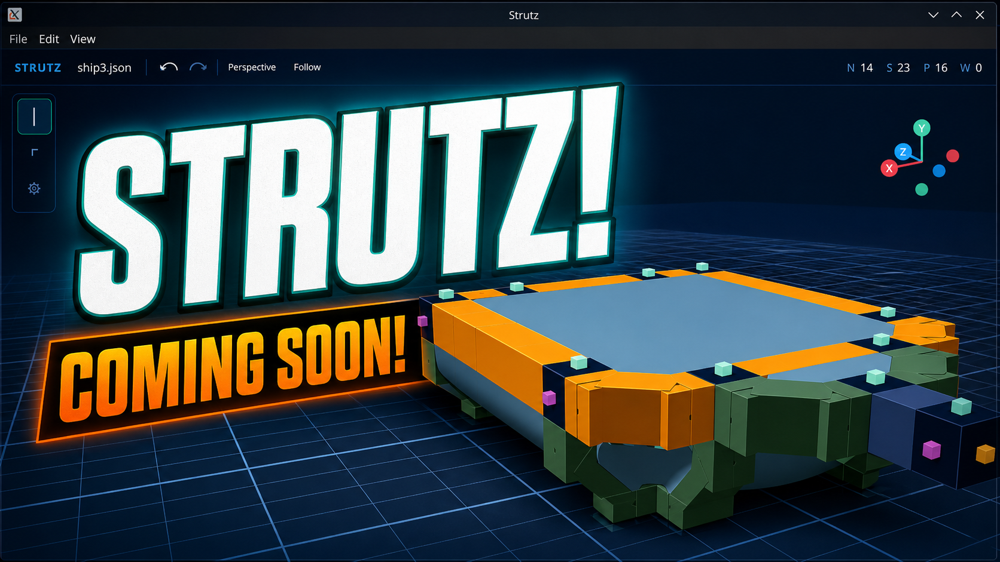
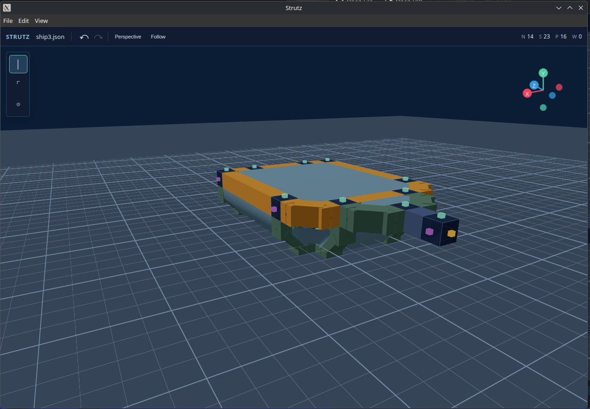

# Strutz

Strutz is an experimental 3D construction editor for building node-and-strut assemblies on a grid. It is built with React, Three.js, and Vite.



## Editor Preview



## Features

- Nodes are created automatically as strut endpoints; there is one node type.
- Start Structural struts by clicking a node, then use mouse direction and distance to choose the axis and catalog length.
- Active Structural draws show direction, construction length, physical meters, and multi-source count beside the inferred endpoint.
- During a Structural draw, lock an axis with `X`, `Y`, or `Z`, and place catalog lengths directly with `1`, `3`, or `7`.
- Extend a multi-node selection with matching straight struts in one operation.
- Use valid strut lengths of `1`, `3`, and `7`.
- Use Structural struts for straight axis-aligned connections and External struts for routed connections between perpendicular faces.
- Subdivide straight struts by inserting nodes.
- Select any part with right-click and extend the selection with `Shift`+left-click.
- Delete selected parts with `Delete` or `Backspace`; placed nodes are not repositionable.
- Undo/redo scene edits.
- Organize parts into named layers from the right sidebar; each layer can be shown or hidden without changing construction or export behavior.
- Select a layer's contents or move the current multi-part selection into the active layer.
- Copy selected assemblies with `Ctrl`/`Cmd`+`C`; required panel boundaries, strut endpoints, and widget host nodes are included automatically.
- Paste with `Ctrl`/`Cmd`+`V`, rotate the placement preview in 90-degree steps, and click the ground grid to commit a collision-free copy.
- Save/open scenes as JSON.
- Export scenes as JSON, OBJ, or glTF.
- Export slicer-ready ASCII STL as one weldable structural mesh at a configurable millimeter scale.
- Orbit the camera with left-drag, middle-drag, or the viewport gizmo.
- Re-center the camera on selected parts while preserving the current view offset.
- Toggle automatic camera follow independently of selection.
- Toggle between perspective and orthographic cameras.
- Hover nodes, struts, panels, and widgets to see a contrasting geometry outline.
- Selecting struts shows whether they form a valid panel loop and exposes explicit `Add Outer` and `Add Inner` actions in the top toolbar.
- Selecting one strut in a closed structure exposes `Select Loop`, which chooses the shortest closed loop containing that strut.
- Hovering or focusing `Add Outer` and `Add Inner` previews the resulting pane before placement.
- Selecting panels exposes a contextual `Flip` action in the top toolbar.

## Getting Started

Install dependencies:

```sh
npm install
```

Start the development server:

```sh
npm run dev
```

Build for production:

```sh
npm run build
```

Run TypeScript checks:

```sh
npm run typecheck
```

## Controls

- `S`: Structural strut mode
- `E`: External strut mode
- `A`: Widget mode
- During a Structural draw, `X`/`Y`/`Z`: Toggle an axis lock
- During a Structural draw, `1`/`3`/`7`: Place that clear strut length
- Right-click a part: select only that part
- Right-click one strut, then choose `Select Loop`: select its shortest containing closed loop
- `Shift`+left-click parts: toggle multi-selection
- `Esc`: Clear selection or cancel drawing
- `Ctrl+Z`: Undo
- `Ctrl+Shift+Z`/`Ctrl+Y`: Redo
- `Ctrl+S`: Save JSON
- `Ctrl`/`Cmd`+`C`: Copy the selected assembly
- `Ctrl`/`Cmd`+`V`: Preview a pasted assembly at the ground grid
- During paste preview, `X`/`Y`/`Z`: Rotate +90° around that world axis
- During paste preview, `Shift+X`/`Shift+Y`/`Shift+Z`: Rotate −90° around that world axis
- `P`: Snap a panel into the next available face of a selected closed strut loop
- `F`: Flip selected panels between their top and bottom faces
- `R`: Rotate selected widgets by 90 degrees around their attachment face
- `O`: Toggle perspective/orthographic camera
- `Delete`/`Backspace`: Delete selected nodes, struts, panels, or widgets

For 3D printing, use **File → Export Printable STL**. The default scale is 2 mm per construction unit; the export dialog previews the resulting node-bound dimensions before writing the file. OBJ and glTF remain render/interchange exports and intentionally use open connection geometry.

## Construction Rules

The formal domain contract, including terminology, validation APIs, and edge cases, is in [docs/construction-rules.md](docs/construction-rules.md). See [docs/architecture.md](docs/architecture.md) before extending the editor.

- Nodes are unit cubes centered on the grid.
- Each node face can hold one attachment: a strut or a widget.
- Straight struts connect opposite faces along one axis only.
- Starting a straight strut from one of several selected nodes previews and places the same length from every selected node as one undoable operation.
- Straight strut clear spans must be `1`, `3`, or `7` grid units.
- Planar corner struts connect perpendicular faces across exactly two axes.
- Each planar-corner axis run independently resolves to a valid strut length; unequal combinations such as 1×3 and 3×7 are allowed.
- Strut geometry routes from face center to face center; planar corners use short face stubs and one flat, aligned middle segment.
- Panels are constrained by one closed, convex loop of selected struts.
- Boundary struts contribute panel-facing inward planes; planar corners use their main diagonal run because their endpoint stubs terminate inside nodes. Coplanar loops use their shared support plane, while folded loops derive exposed planes from local strut faces.
- Invalid or concave loops are rejected instead of producing a warped triangle fan; concave openings should be divided into multiple panel loops.
- Each closed strut loop accepts one panel on each side, allowing an enclosed box to be built from four struts and four nodes.
- Widgets snap to a free node face. Antennas, rocket engines, maneuvering thrusters, repulsor pads, cockpits, and wheels point outward and can rotate in quarter turns. Wheels are 4 units in diameter and 2 units wide, beginning after a 0.5-unit axle extension.
- A thruster's exhaust points outward and its force vector points inward, opposite its attachment normal. Repulsor pads push outward along their attachment normal, making downward-facing pads usable for hover layouts.
- Main engines use a wheel-sized 4-unit-diameter, 2-unit-long body plus a 1.25-unit flared exhaust funnel. Compact thrusters remain the maneuvering and stabilization option.
- Cockpits use a roughly conical 3-unit (2-meter) body. The nose points forward along the attachment normal, a dark raised viewport marks the rolled up direction, and a named camera lens identifies the future runtime camera mount in OBJ/glTF exports.
- Physics-ready scene data can store `massKg` on individual nodes/widgets and scene-level material density, default node mass, and panel thickness. `calculateMassProperties` derives total mass and center of mass in construction units and meters for runtime export.
- Widget placement, rotation, and assembly pasting reject overlapping widget collision volumes while allowing tangential contact.
- Hidden layers remain structurally active and are included in OBJ and glTF exports.

## Notes

This is an early prototype. The data model and interaction rules are still evolving.

## License

MIT
